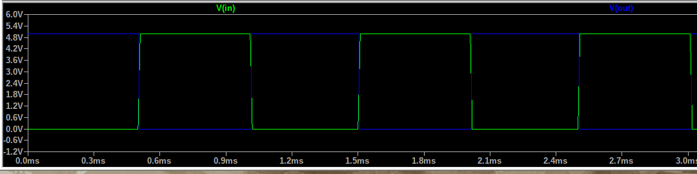
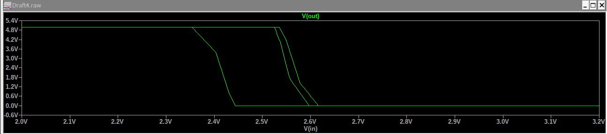

# Laboratorio 1: COMPARACIÓN DE TECNOLOGÍA CMOS y TTL

Electrónica Digital, Grupo 1 - Equipo 4.
Universidad Nacional de Colombia

### Estudiantes: 
    -Juan Felipe Rátiva Sánchez, jrativas@unal.edu.co
    -Santiago Gomez Camargo, sgomezcam@unal.edu.co
    -Cristian Mauricio Gil Pineda crgilp@unal.edu.co

# Objetivos
Plasme aquí los objetivos

# Recursos requeridos
    1.Negador TTL 74LS04
    2.Negador CMOS CD4069
    3.Simulador
    4.Modelos spice
    5.Datasheets

# INTRODUCCIÓN
Para esta primer práctica se realizó la búsqueda de información sobre dos tecnologías en electrónica digital: la tecnología CMOS y la TTL. Para este caso, se trabajaron con los circuitos integrados CMOS CD4069 y TTL 74LS04, cuya estructura interna está compuesta de compuertas negadoras. Para cada una de las tecnologías se revisaron las hojas de datos correspondientes para extraer datos de importancia para esta práctica. Parámetros de tensión como Vih, Vil, Voh y Vol y de tiempo tales como el tiempo de subida "tr", el tiempo de bajada "tf", y el tiempo de retardo "tplh" y "tphl" con el fin de compararlos con los resultados de medición en el laboratorio y exponer conclusiones de acuerdo conla funcionalidad y propiedades de cada tecología.[1],[2] y [3].

# MARCO TEÓRICO
Las compuertas lógicos son circuitos electrónicos que estan internamente conformados por transistores que se encuentran en arreglos especificos segun el tipo de compuerta y la familia a la que pertenezca. Su objetivo principal es breindar una señal de salida en respuesta a operaciones booleanas. En esta ocasión se observara el funcionamiento de las fmilias TTL y CMOS. Las tecnologías TTL (Transistor-Transistor Logic) y CMOS (Complementary Metal-Oxide-Semiconductor) son dos de las más comunes para construir estas compuertas. Cada una tiene aplicaciones distintas, esto debido a sus características, ventajas y limitaciones.

 ## Compuertas TTL
Las compuertas TTL están basadas en transistores bipolares, que forman circuitos lógicos como AND, OR, NOT, entre otros. Estas fueron las primeras tecnologías digitales de alta velocidad ampliamente adoptadas.

   ### Características principales:
    - Tensión de alimentación típica: 5 V.
    - Niveles lógicos:
    - Bajo: 0 V a 0.8 V.
    - Alto: 2 V a 5 V.
    - Velocidad de operación: rápida, típica en nanosegundos (ns).
    - Consumo de potencia: relativamente alto debido al uso de transistores bipolares.

   ### Ventajas de TTL
    - Alta velocidad de conmutación.
    - Mejor tolerancia al ruido en aplicaciones antiguas (mayor corriente de salida).
    - Compatible con dispositivos de la misma familia.
 ## Compuertas CMOS
Las compuertas CMOS están basadas en transistores de efecto de campo (MOSFET) de canal N y P. Son ampliamente utilizadas en dispositivos modernos debido a su bajo consumo de energía.

   ### Características principales:
    - Tensión de alimentación típica: 3.3 V, 5 V o incluso menos en dispositivos modernos.
    - Niveles lógicos:
    - Bajo: 0 V a 0.3 V (para 3.3 V de alimentación).
    - Alto: 0.7 Vcc a Vcc.
    - Velocidad de operación: depende del diseño, más lenta que TTL en configuraciones clásicas pero más eficiente en versiones modernas.
    - Consumo de potencia: muy bajo en estado estático (solo durante transiciones de encendido/apagado).

   ### Ventajas de CMOS
    - Consumo de potencia extremadamente bajo.
    - Alta densidad de integración (millones de compuertas en un chip).
    - Mayor rango de tensiones de alimentación en tecnologías modernas.
    - Parámetros Importantes: Fan-Out y Tiempos de Subida

## Cálculo del Fan-Out
El fan-out se define como la cantidad máxima de entradas de otras compuertas que una compuerta puede manejar sin degradar significativamente sus niveles lógicos.

### Fan-out en TTL
Para el caso de los dispositivos TTL, se calcula usando las corrientes:

   $Fan-out=\frac{I_{OL}}{I_{IL}}$ (Nivel bajo) y $Fan-out=\frac{I_{OH}}{I_{IH}}$ (Nivel alto)

Donde $I_{IL}$ e $I_{IH}$ son las corrientes de entrada, mientras que $I_{OL}$ e $I_{OH}$ son las corrientes de salida.

### Fan-out en CMOS
Para el caso de los dispositivos CMOS, se calcula usando las capacitancias de entrada y salida:

   $Fan-out=\frac{C_{salida}}{C_{entrada}}$

### Tiempos de subida y bajada

Tiempos de Subida y Bajada
Los tiempos de subida (t_r) y bajada (t_f) representan el tiempo que tarda la señal en pasar de un nivel alto a un nivel bajo y de in nivel bajo a un nivel alto.

En TTL, los tiempos son más cortos debido a la rapidez de los transistores bipolares.
En CMOS, los tiempos dependen de la capacitancia de las líneas de señal y las resistencias internas.

Para el cálculo de tiempos en el dispositivo CMOS se puede usar una formula aproximada que es:

   $t_r,t_f=0.693*R*C$

Donde R es la resistencia de salida del MOSFET y C es la capacitancia de la carga.

Otra manera mas exacta de calcularlo es con la siguiente ecuación:

   $t_r=\frac{9xC}{K_pxV_{DD}}$

Donde $K_p$ y $K_n$ corresponden  a parametros internos de los transistores PMOS y NMOS.

## RESULTADOS DE SIMULACIÓN 
Para tomar los datos de las simulaciones se empleó el siguiente esquemático compuesto de una fuente dc de 5V y un generador de onda cuadrada, conectado a su respectivo Negador (TTL o CMOS), tal y como se presenta en la siguiente imagen:

 

_**Imágen 1.** Esquemático del citcuito utilizado en la simulación_

### TTL 74LS04

_**Imágen 2.** Señal de entrada y de salida del circuito TTL 74LS04_

Por medio del análisis del voltaje de salida se obtuvieron los tiempos de subida y bajada: 

_**Imágen 3.** Tiempo de bajada del TTL 74LS04_

_**Imágen 4.** Tiempo de subida del TTL 74LS04_

Según la imágen **3** se identificó un tiempo de bajada de 9.88 × 10⁻⁹ segundos (9.88 nanosegundos); mientras que el tiempo de subida encontrado en la imagen **4** es de 24.2 × 10⁻⁹ segundos (24.2 nanosegundos).

Luego, se procedió a sacar la función de transferencia mediante la gráfica de $$\mathit{V_{in}}$$ vs $$\mathit{V_{out}}$$, obteniendo lo siguiente: 

_**Imágen 4.** Función de transferencia del TTL 74LS04_

### CMOS CD4069

Por su parte, para el negador CD4069 mostró los siguientes comportamientos:

_**Imágen 6.** Señal de entrada y de salida del circuito CMOS CD4069_

_**Imágen 7.** Tiempo de bajada del CMOS CD4069_

_**Imágen 8.** Tiempo de subida del CMOS CD4069_

Según la imágen **7** se identificó un tiempo de bajada de 118.52 × 10⁻⁹ segundos (118.52 nanosegundos); mientras que el tiempo de subida encontrado en la imagen **8** es de 133.74 × 10⁻⁹ segundos (133.74 nanosegundos). Todos estos valores son considerablemente grandes comparandolo con el TTL 74LS04.

La función de transferencia resultante sería: 

_**Imágen 9.** Función de transferencia del CMOS CD4069_

## RESULTADOS EXPERIMENTALES
En primer lugar, se realizó la comparación entre cada uno de los circuitos integrados, las tablas **tabla 1** y **tabla 2** se muestran a continuación [1] y [2]:

### TTL 74LS04

**Tabla 1.** Tabla de datos técnicos del circuito integrado TTL 74LS04, tensiones.

### CMOS CD4069
}
**Tabla 2.** Tabla de datos técnicos del circuito integrado CMOS CD4069, tensiones.

De acuerdo a la información de las tablas **1 y 2**, se puede hacer una primer observación sobre el desempeño de cada familia:

El CD4069 tiene un consumo de energía mucho más bajo en comparación con el 74LS04. El CD4069 tiene una velocidad de operación más alta, con tiempos de subida y caída en escala de ns,mientras que el 74LS04 tiene una velocidad de operación más baja. El CD4069 tiene una mayor inmunidad al ruido debido a su tecnología CMOS, según lo visto también en la teoría [1] [2] y [4].

Posteriormente, se realizó el montaje físico, implementando una señal cuadrada de 1kHz de frecuencia y 5 $$\mathit{V_{pp}}$$, con el fin de observar $$\mathit{V_{in}}$$ vs $$\mathit{V_{out}}$$. Además, fue posible observar la función de transferencia y determinar Voh, Vih, vol, Vil[4]. A continuación, en la **imagen 2**, se muestra la medición de $$\mathit{V_{in}}$$ vs $$\mathit{V_{out}}$$.

}
**Imágen 2.** Medición experimental de $$\mathit{V_{in}}$$ vs $$\mathit{V_{out}}$$ con el CMOS CD4069.

}
**Imágen 3.** Medición experimental de $$\mathit{V_{in}}$$ vs $$\mathit{V_{out}}$$ con el TTL 74LS04.s

## ANÁLISIS Y COMPARACIÓN DE RESULTADOS 

## CONCLUSIONES
1.
2.
3. 
4.LAs simulaciones mostraron la rápidez que tienen los integrados TTL 74LS04 en el tiempo de subida y bajada respecto a los integrados CMOS CD4069.
## Referencias
    -[1]. PDF Datasheet integrated circuit TTL 74LS04
    -[2]. PDF Datasheet integrated circuit CMOS CD4069
    -[3]. J.Ramirez, "Comparación de tecnología CMOS y TTL," GitHub, https://github.com/digital-electronics-UNAL/2024-2/tree/main/labs/lab01#comparaci%C3%B3n-de-tecnolog%C3%ADa-cmos-y-ttl (2024).
    -[4]. T. L. Floyd, "Fundamentos de Sistemas Digitales," 9th ed., Pearson Educación, 2006.
